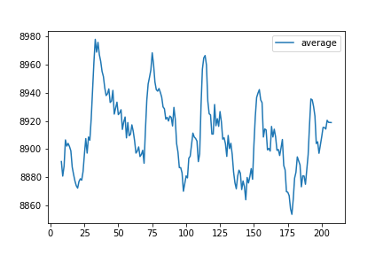
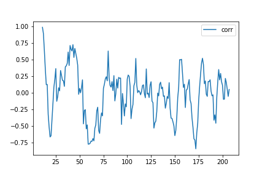

# Analysis tutorial

* [**Download Pyneal**](https://github.com/jeffmacinnes/pyneal)
* [**Pyneal Documentation**](https://jeffmacinnes.github.io/pyneal-docs/)


This tutorial will walk you though how to run a real-time analysis using Pyneal. The tutorial will cover 2 different use cases:

* **Built-in Analysis**: Use Pyneal's [built in analysis](https://jeffmacinnes.github.io/pyneal-docs/pyneal/#analysis) options to compute mean activation from a single ROI on each timepoint. 
* **Custom Analysis**: Use the [custom analysis](https://jeffmacinnes.github.io/pyneal-docs/customAnalysis/) option to create and run a custom analysis script in Pyneal. 

[TOC]

# Setup
***Note:*** These instructions assume that you have downloaded [**Pyneal**](https://github.com/jeffmacinnes/pyneal) and the [**Pyneal-tutorial**](https://github.com/jeffmacinnes/pyneal-tutorial) repositories to your local home directory. If so, you should have the following two directories in your local home directory:

* `~/pyneal`
* `~/pyneal-tutorial`

## Source data

The source data for this tutorial comes from a simple hand squeezing task, in which the subject performed alternating blocks of REST and SQUEEZE (right hand). Each block was 20s long. The task began with a REST block. Each block was repeated 5 times, yielding a total scan duration of 200s, plus an additional 8s of dummy scans at the beginning of the run. 

* Scan Parameters:
	* dimensions: 64 x 64 x 18 slices
	* TR: 1000ms
	* timepoints: 208

For the purposes of this tutorial, we have also included 2 anatomical mask files that have already been transformed to subject functional space. In a real-life scenario, you can transform masks to subject functional space with the help of the [Create Mask](https://jeffmacinnes.github.io/pyneal-docs/createMask/) tool included with Pyneal. 

## Pyneal Scanner Sim

In a real-life scan, Pyneal Scanner would be responsible for reading raw images coming off of the scanner and sending them to Pyneal for further analysis. However, we can simulate this behavior in a test setting using the **Pyneal Scanner Simulator** tool included with Pyneal (found at `~/pyneal/utils/simulation/pynealScanner_sim.py`)

`pynealScanner_sim.py` has the option of either generating fully random data (with user-specified volume dimensions) or reading in an existing Nifti-format data file. In either case, `pynealScanner_sim.py` will divide the data into individual 3D volumes, and transmit each volume to Pyneal at the rate that you specify. For a full list of options, run:

> python pynealScanner_sim.py -h

In each tutorial below, we'll be using the same presupplied Nifti file as our input data. To run the **Pyneal Scanner Simulator**, open a new terminal window and navigate to the **Simulation Tools** directory:

`cd ~/pyneal/utils/simulation`

Each tutorial below will repeat the specific command you need to run to start the simulation. The command will be the same in each case. For reference:

`python pynealScanner_sim.py -f ~/pyneal-tutorial/analysisTutorial/func.nii.gz -t 1000 -sh 127.0.0.1 -sp 5555`

Note that we are setting the path the sample data we'd like to use for our simulated scan, setting a TR of 1000ms, and providing the host and port parameters for setting up the connection to Pyneal. 
 

# Built-in Analysis

This section will walk through one of the most straight-forward use cases: Using Pyneal to compute the mean activation within an ROI on a timepoint-by-timepoint basis. Pyneal includes basic analyis options for computing the mean or median activation within a single ROI on each timepoint. Users can choose this option via the Pyneal GUI and supply the mask file of their choice. 

In this section, we'll demonstrate a real-time scan in which we use Pyneal to compute the mean activation within the Left motor cortex on every timepoint. 

## 1. Set up Scan Simulator

The first step is to set up **Pyneal Scanner Simulator**, which will send our sample dataset to Pyneal as though it was a real scan. 

* In a new terminal, navigate to the **Simulation Tools** directory:

	```
	cd ~/pyneal/utils/simulation
	```
	
* Run `pynealScanner_sim.py` and pass in the path to our sample dataset:

	```
	python pynealScanner_sim.py -f ~/pyneal-tutorial/analysisTutorial/func.nii.gz -t 1000 -sh 127.0.0.1 -sp 5555
	```
	
* Hit enter, and you should see the simulator prepare the data and wait for a connection to Pyneal:

	```
	Prepping dataset: ~/pyneal-tutorial/analysisTutorial/func.nii.gz
	Dimensions: (64, 64, 18, 208)
	TR: 1000
	Connecting to Pyneal at 127.0.0.1:5555
	waiting for connection...
	```
	
## 2. Set up Pyneal


Next, configure Pyneal to compute the mean signal from within a Left Motor Cortext mask. 

* In a new terminal, launch Pyneal:
	
	```
	cd ~/pyneal
	python pyneal.py
	```
	
* Configure Pyneal:
	* **Communication**: Make sure `Pyneal Host IP` is set to `127.0.0.1` and the `Pyneal-Scanner Port` is `5555`. 
	* **Mask**: In the `~/pyneal-tutorial/analysisTutorial/masks/` directory, select `L_MotorCortext.nii.gz`. Note that this is an anatomically-defined mask that has been transformed to the functional space coordinates of this scan. 
	* **Preprocessing**: Set `# of timepts` to: `208`
	* **Analysis**: Select the `Average` option
	* **Output**: Set the output directory to `~/pyneal-tutorial/analysisTutorial/output`.

* Hit `Submit`

## 3. Start the scan

* Back in the **Scan Simulator** terminal, you should see a successful connection to Pyneal

	```
	connected to pyneal
	Press ENTER to begin the "scan"
	```
	
* Hit `Enter` to begin the simulated scan

As the scan is progressing, you should see information about each volume appear in both the **Scan Simulator** and **Pyneal** terminals, indicating the volumes are being successfully transmitted and processed. 


## 4. Results

* At the completion of the scan, you can find the following **Pyneal** output files in `~/pyneal-tutorial/analysisTutorial/output/pyneal_001` (*Note*: the directory names increase in sequence. If this is the first time saving output to this directory, it'll be `_001`, otherwise it'll be a larger number):
	* `pynealLog.log`: complete log file from the scan
	* `receivedFunc.nii.gz`: 4D Nifti of the data, as received by **Pyneal**
	* `results.json`: JSON-formatted file containing the computed analysis results at each timepoint. 


* Since our data came from a simple hand squeezing task and we were computing the average signal within the Left Motor Cortext, we should expect to see a fairly robust signal in the results, following the alternating blocks design of the task. 
	* To confirm, you can open the `results.json` file and plot the results at each timepoint using your preferred tools. 
	* Here's an example of doing this using the Pandas library for Python:

	```
	import pandas as pd
	results = pd.read_json(
		'~/pyneal-tutorial/analysisTutorial/output/pyneal_001/results.json', 
		orient='index', 
		dtype=True)
	results.sort_index(inplace=True)
	results[8:].plot()   # <- skip dummy scans
	```
	
	

 
# Custom Analysis
This section will walk through creating an implementing a custom analysis script using Pyneal.

In addition to built-in analysis options, Pyneal also allows users to develop their own fully customized analysis routines written in Python. These routines are executed on every incoming volume, and the results are stored in the same manner as the built-in analysis tools. 

Users define their custom analyses within a templated python script that includes the basic structure needed to integrate into the Pyneal pipeline. Users are free to import external libraries, load additional files, and develop algorithms suited to their analysis needs. To make it easier to develop this script, Pyneal includes a `customAnalysisTemplate.py` file that users can modify (see [**Customized Analyses**](https://jeffmacinnes.github.io/pyneal-docs/customAnalysis/) in the documentation for more information). 

In this section, we'll develop a custom analysis script that computes a sliding window correlation between two ROIs. The simulated scan data will be the same as in the Built-in Analysis section above -- a hand squeezing task with an alternating block design. We'll compute correlations between ROIs from the Left Motor Cortext, and the Left Caudate. 
 
 
## 1. Setup Scan Simulator

The first step is to set up **Pyneal Scanner Simulator**, which will send our sample dataset to Pyneal as though it was a real scan. 

* In a new terminal, navigate to the **Simulation Tools** directory:

	```
	cd ~/pyneal/utils/simulation
	```
	
* Run `pynealScanner_sim.py` and pass in the path to our sample dataset:

	```
	python pynealScanner_sim.py -f ~/pyneal-tutorial/analysisTutorial/func.nii.gz -t 1000 -sh 127.0.0.1 -sp 5555
	```
	
* Hit enter, and you should see the simulator prepare the data and wait for a connection to Pyneal:

	```
	Prepping dataset: ~/pyneal-tutorial/analysisTutorial/func.nii.gz
	Dimensions: (64, 64, 18, 208)
	TR: 1000
	Connecting to Pyneal at 127.0.0.1:5555
	waiting for connection...
	```
	
## 2. Setup Custom Analysis Script

This tutorial includes a custom analysis script that we will load into pyneal. This script can be found at: `~/pyneal-tutorial/analysisTutorial/customAnalysis_ROI_corr.py`. Open this file to follow along below. This script is adapted from the `customAnalysisTemplate.py` that is included in Pyneal. 

There are two relevant sections to this script:

### initialize

The analysis script includes an `__init__` method that runs once when Pyneal is launched. This section should be used to load any required files and initialize any variables needed once the scan begins. 

In the `__init__` method in the tutorial script, you'll find the following code block:

```
## Load the mask files for the 2 ROIs we will compute the correlation between
# Note: we will be ignoring the mask that is passed in from the Pyneal GUI
mask1_path = join(self.customAnalysisDir, 'masks/L_Caudate.nii.gz')
mask2_path = join(self.customAnalysisDir, 'masks/L_MotorCortex.nii.gz')
mask1_img = nib.load(mask1_path)
mask2_img = nib.load(mask2_path)

self.masks = {
    'mask1': {
        'mask': mask1_img.get_data() > 0,   # creat boolean mask
        'vals': np.zeros(self.numTimepts)   # init array to store mean signal on each timept
    },
    'mask2': {
        'mask': mask2_img.get_data() > 0,
        'vals': np.zeros(self.numTimepts)
    }

}
    
## Correlation config
self.corr_window = 10  # number of timepts to calculate correlation over
```

This block of code 

* Loads each mask file. Note that while the template provides a reference to the mask file loaded via the Pyneal GUI, we are ignoring that mask and instead loading each mask manually. 
* Preallocates an array for each mask where we will store the mean signal within that mask on each timepoint
* Sets the correlation window to 10 timepoints, meaning that, with each new volume that arrives, the correlation between the two ROIs will be computed over the previous 10 timepoints 

### compute

The `compute` method will be executed on each incoming volume throughout the scan, and provides the image data (`vol`) and volume index (`volIdx`) as inputs. This method should be used to define analysis steps. 

In the `compute` method in the tutorial script, you'll find the following code block: 

``` 
## Get the mean signal within each mask at this timept
for roi in self.masks:
    mask = self.masks[roi]['mask']
    meanSignal = np.mean(vol[mask])
    self.masks[roi]['vals'][volIdx] = meanSignal


## Once enough timepts have accumulated, start calculating rolling correlation
if volIdx > self.corr_window:
    # get the timeseries from each ROI over the correlation window
    roi1_ts = self.masks['mask1']['vals'][volIdx-self.corr_window:volIdx]
    roi2_ts = self.masks['mask2']['vals'][volIdx-self.corr_window:volIdx]

    # compute correlation, return r-value only
    corr = stats.pearsonr(roi1_ts, roi2_ts)[0]
else:
    corr = None    
    
return {'corr': corr }
```

This block of code:

* computes the mean signal within each mask at the current timepoint. 
* Once enough volumes have arrived, computes the correlation between the two ROIs over the specified correlation window. 
* returns the result of the correlation as a dictionary. 

So long as the results are returned via a dictionary, Pyneal will integrate these results into the existing pipeline and the results will be available via the results server in the same manner as with the built-in analysis options. 

## 3. Set up Pyneal

Next, configure Pyneal to use the custom analysis script developed above

* In a new terminal, launch Pyneal:
	
	```
	cd ~/pyneal
	python pyneal.py
	```
	
* Configure Pyneal:
	* **Communication**: Make sure `Pyneal Host IP` is set to `127.0.0.1` and the `Pyneal-Scanner Port` is `5555`. 
	* **Mask**: In the `~/pyneal-tutorial/analysisTutorial/masks/` directory, select `L_MotorCortext.nii.gz`. Note that although the custom analysis script overrides the mask supplied here, a valid mask file is required nonetheless. 
	* **Preprocessing**: Set `# of timepts` to: `208`
	* **Analysis**: Select the `Custom` option. You will be presented with a file dialog. Select the custom analysis script at `~/pyneal-tutorial/analysisTutorial/customAnalysis_ROI_corr.py`
	* **Output**: Set the output directory to `~/pyneal-tutorial/analysisTutorial/output`.

* Hit `Submit`

## 4. Start the scan

* Back in the **Scan Simulator** terminal, you should see a successful connection to Pyneal

	```
	connected to pyneal
	Press ENTER to begin the "scan"
	```
	
* Hit `Enter` to begin the simulated scan

As the scan is progressing, you should see information about each volume appear in both the **Scan Simulator** and **Pyneal** terminals, indicating the volumes are being successfully transmitted and processed. 

## 5. Results

* At the completion of the scan, you can find the following **Pyneal** output files in `~/pyneal-tutorial/analysisTutorial/output/pyneal_002` (*Note*: the directory names increase in sequence. If you've been following the tutorial in sequence, it'll be `_002`, otherwise it'll be a different number):
	* `pynealLog.log`: complete log file from the scan
	* `receivedFunc.nii.gz`: 4D Nifti of the data, as received by **Pyneal**
	* `results.json`: JSON-formatted file containing the computed analysis results at each timepoint. 


* Our custom analysis script computed a sliding window correlation between the Left Motor Cortext and the Left Caudate throughout the task.   
	* To visualize these results, you can open the `results.json` file and plot the results at each timepoint using your preferred tools. 
	* Here's an example of doing this using the Pandas library for Python:

	```
	import pandas as pd
	results = pd.read_json(
		'~/pyneal-tutorial/analysisTutorial/output/pyneal_002/results.json', 
		orient='index', 
		dtype=True)
	results.sort_index(inplace=True)
	results[8:].plot()   # <- skip dummy scans
	```
	
	
	
	

	* The correlation values range between [-1,1]. 

* This section demonstrates how you can develop a customized analysis script, and use that script to execute real-time analyses that are tailored to your experiemental needs. The custom analysis script is a powerful and flexible option for adapting Pyneal to a wide range of purposes. 